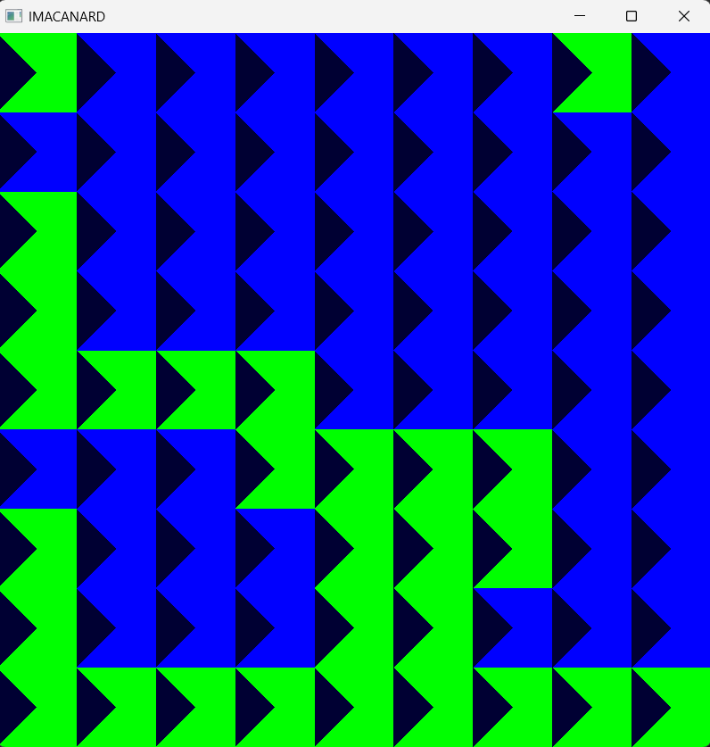

# 🦆 IMACANARD

IMACANARD est un jeu créé dans le cadre des cours *Programmation et algorithmique C++* et *Synthèse d'images I*.

Il a été implémenté par Emilie DESOMBRE, Océane DRAPEAU et Claire GOBERT. Il fonctionne sur Windows et Linux.

## 🎲 Règles du jeu 

IMACANARD se joue au clavier. Le joueur se déplace à l'aide des flèches du clavier <kbd>↑</kbd> <kbd>↓</kbd> <kbd>←</kbd> <kbd>→</kbd>.

Il mine un bloc plein (nénuphar) avec <kbd>a</kbd>.

Il peut quitter le jeu à tout moment avec <kbd>q</kbd>.

## 🎨 Thème du jeu

Le joueur incarne un canard qui cherche à échapper à des loutres. Il se déplace dans une étendue d'eau et peut détruire des nénuphars. Lorsqu'il détruit des nénuphars, il peut collecter des ombres. Cependant, il ne peut pas aller sur les rochers. De plus, s'il prend un tourbillon, il perd la partie.

## 🧐 Spécifications

### Joueur
Le joueur possède une seule vie et perd si l'ennemi arrive sur sa case ou s'il tombe dans un piège. Il est représenté par un canard jaune. Lorsqu'il mine, il y a un pourcentage de chances pour obtenir un objet.

### Ennemis
Les ennemis cherchent à atteindre le joueur. Ils sont représentés par des loutres.

### Les blocs
Nous avons utilisé la répartition des cases suivantes : 
- **Bloc vide (0):** représenté par un bloc bleu (sans textures) et un bloc d'eau (avec textures). Le joueur peut aller dessus.

- **Bloc plein (1):** représenté par un bloc bleu (sans textures) et un bloc de pierre sur un bloc d'eau (avec textures). Le joueur ne peut pas aller dessus à moins de détruire le bloc.

- **Objet (4):** représenté par un bloc bleu foncé (sans textures) et une ombre (avec textures). Le joueur peut collecter des objets.

- **Obstacle (2) :** représenté par un bloc bleu (sans textures) et un bloc d'eau et un nénuphar (avec textures). Le joueur ne peut jamais aller dessus.

- **Piège (5):** représenté par un bloc bleu clair (sans textures) et un bloc d'eau et un tourbillon (avec textures). Le joueur peut aller dessus mais c'est la fin de la partie.

- **Accélérateur (3):** représenté par un bloc jaune-vert (sans textures) et des fleurs. Il donne au joueur un court boost de vitesse.

- **Ralentisseur (6):** représenté par un bloc violet (sans textures) et des roseaux. Il diminue temporairement la vitesse du joueur.

Ces cases sont implémentés à l'aide d'une struct est constitué de positions et d'une valeur correspondant au type de bloc. Les types de bloc sont stockés dans une classe. 

### Génération de la carte
La carte est généré avec l'algorithme de génération procédurale cellular automata. Dans un premier temps, on y génère des cases vides ou pleines (0 ou 1) avec 50% de chances chacune. Dans un second temps, on regarde les cases adjacentes individuellement, et on y ajuste leur caractère plein ou vide en fonction des voisins.

Puis on y ajoute des objets, des cases pièges, des obstacles, et des modificateurs de vitesse.

Le joueur et les ennemis sont ajoutés après la carte.

### Flow field pathfinding
La direction des ennemis est définie grace à l'algorithme de recherche Breadth-First Search.

### Interface graphique
Pour réaliser le menu et l'écran de fin de jeu, nous avons utilisé la librairie imgui.
Le jeu contient donc un menu via lequel le joueur peut accéder à une page de règles et une page de paramètres. Il peut s'il le souhaite changer la taille de la grille de jeu et le nombre d'ennemis présents.

## Post mortem

### Ce qui a bien fonctionné

tkt

### Problèmes rencontrés

### Ennemis

La fonction de déplacement des ennemis n'est pas optimisée suffisament, une meilleure gestion dans l'espace leur permettraient de suivre le joueur en permanence. Actuellement, il arrive que les ennemis se bloquent aux coins des murs.

#### Compilation

Il y a eu plusieurs problèmes de compilation : d'abord quand on a ajouté les textures, une de nous avait la fenêtre OpenGL qui n'arrivait pas à charger. Ce qu'on croyait d'abord être dû à un manque de capacité de l'ordinateur était en fait causé par l'utilisation de Clang au lieu de GCC.

#### Affichage de la carte
L'affichage de base de la map a été un problème. Nous avons cherché à recréer nous même les objets mais nous nous sommes trompés de GL_TRIANGLE_FAN et ça nous a renvoyé quelques erreurs 

Puis ce fut au tour des buffers. En rentrant un mauvais nombre de coordonnées, notre carte s'est déformée.


#### Les textures
L'affichage des textures a été très compliqué. Nous voulions les initialiser, puis les utiliser en les stockant dans une liste. Cependant, les textures, de par leur composition "s'auto détruisaient", lorsqu'on cherchait à y accéder, elles ne s'affichaient pas. De plus, aucun message d'erreur n'était renvoyé, ne permettant pas de comprendre ce qui n'allait pas.

Après jours d'expérimentation, nous avons fini par demander de l'aide à Enguerrand De Smet. La solution a finalement été de rajouter des ligneslignes manquantes au fichier de texture. 

#### Les sprites

L'affichage des sprites était également compliqué. En effet, il fallait normaliser les images qui par défaut n'étaient pas dans le même repère que les textures. Par ailleurs, le lien entre le fait que les coordonnées de la texture dans le buffer correspondait aux coordonnées du sprite à utiliser a été compliqué à comprendre. C'est par hasard que nous avons fait la correspondance. Lorsque nous avons utilisé le mauvais de tableau de coordonnées dans le buffer.


Par ailleurs, les images étaient à l'envers. Nous avons ajouté ```cpp stbi_set_flip_vertically_on_load(true);```
pour retourner les images.

### Avec plus de temps

Avec plus de temps, nous aurions aimé approfondir un peu plus le jeu. Notamment, rajouter des animations ou améliorer la génération de la carte.

<!-- Ajoutez enfin une partie "Post mortem" pour analyser le travail fourni, qu'est ce qui a bien fonctionné, quels ont été les problèmes rencontrés, comment vous les avez surmontés, auriez-vous fait différemment ? Avec plus de temps, qu'est ce que vous pourriez ajouter ? -->


<!-- pour mettre des captures d'écran : créer dossier screenshots puis -->
 
<!-- Éventuellement, si vous souhaitez mettre en avant un bout de code pour sa performance ou parce qu’il s’agit d’une idée intéressante, vous pouvez l'intégrer dans le rapport (mais rester succinct). -->